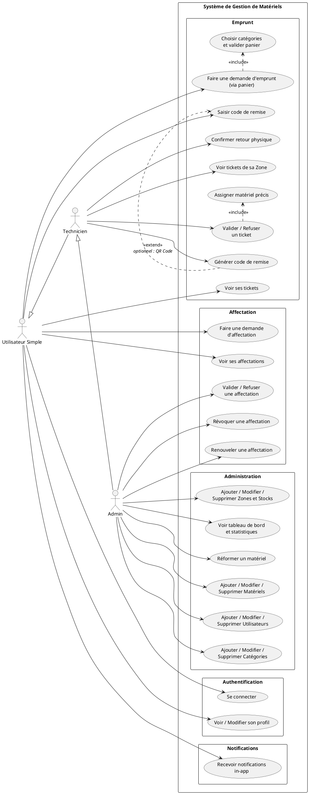
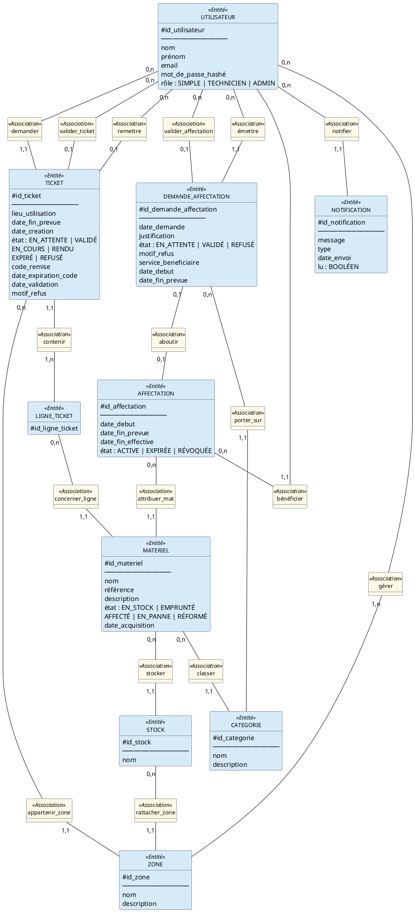
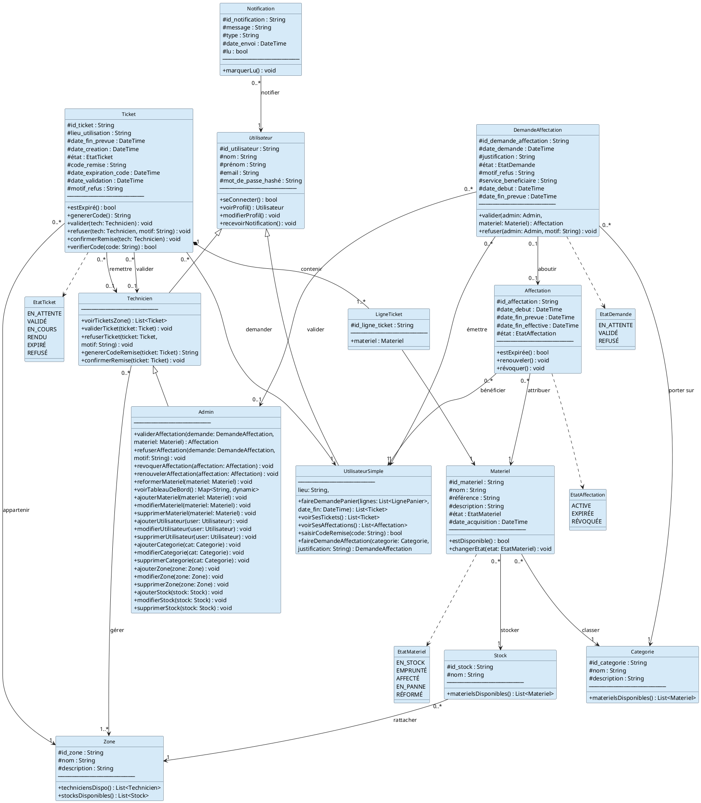
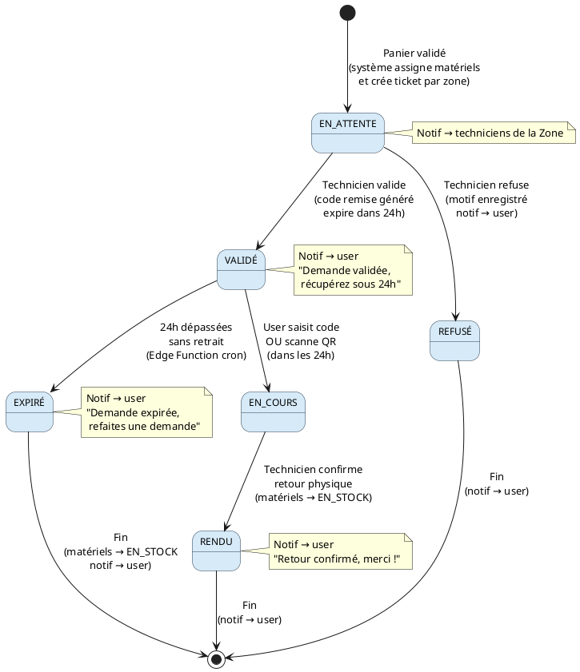
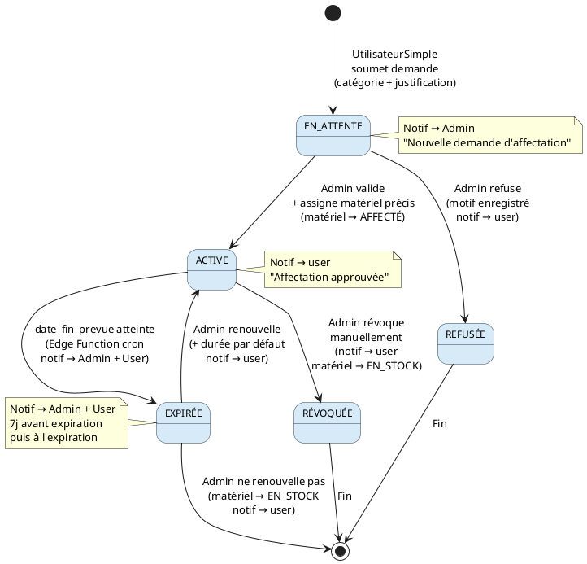
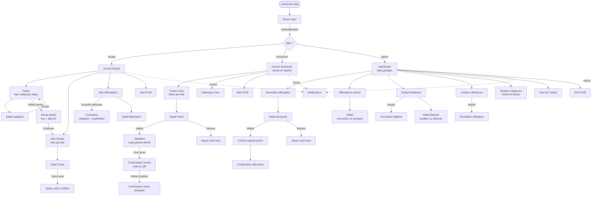

# 📦 Gestion de Matériels Informatiques

## Document de Conception — Projet IHM

**Équipe :** Tino · Jocelyn  
**Stack :** Flutter + Supabase  
**Méthodes :** UML + Merise  

---

## 📋 Table des matières

1. [Périmètre fonctionnel](#1-périmètre-fonctionnel)
2. [Acteurs et rôles](#2-acteurs-et-rôles)
3. [Règles métier](#3-règles-métier)
4. [Use Case Diagram](#4-use-case-diagram)
5. [MCD Merise](#5-mcd-merise)
6. [MLD](#6-mld)
7. [Diagramme de classes UML](#7-diagramme-de-classes-uml)
8. [Diagrammes d'états](#8-diagrammes-détats)
9. [Flux de navigation](#9-flux-de-navigation)
10. [Design System](#10-design-system)
11. [Architecture technique](#11-architecture-technique)
12. [Structure Supabase](#12-structure-supabase)
13. [Edge Functions](#13-edge-functions)
14. [Division du travail](#14-division-du-travail)
15. [Git Workflow](#15-git-workflow)

---

## 1. Périmètre fonctionnel

### Entités gérées

- **Matériels** (PC, écrans, imprimantes, projecteurs, câbles...)
- **Catégories** de matériels
- **Zones** et **Stocks** (lieux physiques)
- **Utilisateurs** avec rôles hiérarchiques
- **Emprunts** via système de tickets (panier → tickets par zone)
- **Affectations** long terme (imprimante, écran, PC de bureau...)
- **Notifications** in-app

### Fonctionnalités principales

- Système de **panier** : l'utilisateur ajoute des catégories, valide, le système crée des tickets par zone
- Système de **tickets** : workflow de validation avec code de remise à 6 chiffres
- Système d'**affectations** long terme avec durée configurable
- **Tableau de bord** avec statistiques pour l'Admin
- **Notifications** in-app en temps réel (Supabase Realtime)

### Fonctionnalités optionnelles *(si le temps le permet)*

- QR Code à la place du code 6 chiffres
- Envoi de notifications par email

---

## 2. Acteurs et rôles

Héritage hiérarchique : **Tout ce que fait Simple, Technicien peut le faire. Tout ce que fait Technicien, Admin peut le faire.**

| Rôle | Responsabilités spécifiques |
| --- | --- |
| **UtilisateurSimple** | Faire des demandes via le panier, voir ses tickets, faire des demandes d'affectation, saisir le code de remise |
| **Technicien** | Valider/refuser les tickets de sa Zone, générer le code de remise, confirmer le retour physique |
| **Admin** | Valider/refuser les affectations, révoquer/renouveler, CRUD complet, tableau de bord |

---

## 3. Règles métier

```text
RG-01 : Un matériel disponible peut être demandé via le panier.
         Si aucun matériel disponible dans une catégorie → bouton désactivé.

RG-02 : À la validation du panier, le système assigne automatiquement
         les matériels disponibles et crée 1 ticket par zone concernée.

RG-03 : Si un matériel devient indisponible entre l'ajout au panier
         et la validation → ligne retirée + notification user.

RG-04 : Un ticket validé expire après 24h sans retrait.
         L'utilisateur doit refaire une demande.

RG-05 : Le code de remise (6 chiffres) est généré par le Technicien
         à la validation. Il est valide jusqu'au retrait ou à l'expiration.

RG-06 : Le Technicien qui valide peut être différent de celui
         qui remet physiquement le matériel (les deux sont enregistrés).

RG-07 : Le retour physique d'un matériel doit être confirmé
         par un Technicien → matériel passe EN_STOCK.

RG-08 : Tout Stock appartient à une Zone.
         Toute Zone doit avoir au moins un Technicien assigné.

RG-09 : La demande de ticket est envoyée à la Zone entière.
         N'importe quel Technicien de la Zone peut la traiter.

RG-10 : La durée par défaut d'une affectation est de 90 jours.
         L'Admin reçoit une notification 7 jours avant expiration.

RG-11 : Un matériel affecté ou emprunté ne peut pas faire l'objet
         d'une nouvelle demande.

RG-12 : Le lieu de rattachement (lieu_stock) d'un matériel
         ne change jamais automatiquement.
         Seul un Admin peut le modifier explicitement.

Valeurs hardcodées (Edge Functions) :
  VALIDITE_DEMANDE   = 24h
  DUREE_AFFECTATION  = 90 jours
  DELAI_NOTIF_AVANT  = 7 jours
```

---

## 4. Use Case Diagram



---

## 5. MCD Merise



---

## 6. MLD

```text
UTILISATEUR (id_utilisateur PK, nom, prénom,
             email, mot_de_passe_hashé, rôle)

ZONE (id_zone PK, nom, description)

STOCK (id_stock PK, nom,
       id_zone FK → ZONE)

CATEGORIE (id_categorie PK, nom, description)

MATERIEL (id_materiel PK, nom, référence,
          description, état, date_acquisition,
          id_categorie FK → CATEGORIE,
          id_stock FK → STOCK)

GERER (id_utilisateur FK → UTILISATEUR,
       id_zone FK → ZONE,
       PK (id_utilisateur, id_zone))

TICKET (id_ticket PK, lieu_utilisation,
        date_fin_prevue, date_creation,
        état, code_remise, date_expiration_code,
        date_validation, motif_refus,
        id_demandeur FK → UTILISATEUR,
        id_valideur FK → UTILISATEUR nullable,
        id_remetteur FK → UTILISATEUR nullable,
        id_zone FK → ZONE)

LIGNE_TICKET (id_ligne_ticket PK,
              id_ticket FK → TICKET,
              id_materiel FK → MATERIEL)

DEMANDE_AFFECTATION (id_demande PK,
                     date_demande, justification,
                     état, motif_refus,
                     service_beneficiaire,
                     date_debut, date_fin_prevue,
                     id_demandeur FK → UTILISATEUR,
                     id_valideur FK → UTILISATEUR nullable,
                     id_categorie FK → CATEGORIE)

AFFECTATION (id_affectation PK,
             date_debut, date_fin_prevue,
             date_fin_effective, état,
             id_materiel FK → MATERIEL,
             id_beneficiaire FK → UTILISATEUR,
             id_demande FK → DEMANDE_AFFECTATION)

NOTIFICATION (id_notification PK,
              message, type, date_envoi, lu,
              id_utilisateur FK → UTILISATEUR)

Total : 11 tables
```

---

## 7. Diagramme de classes UML



---

## 8. Diagrammes d'états

### 8.1 États — Ticket



### 8.2 États — Affectation



---

## 9. Flux de navigation



### Écrans à produire dans Figma

| Rôle | Écrans |
| --- | --- |
| Auth | Login |
| UtilisateurSimple | Accueil, Panier, Récap panier, Mes Tickets, Détail Ticket, Mes Affectations, Formulaire affectation |
| Technicien | Accueil, Liste tickets zone, Détail ticket, Validation + code, Confirmation remise, Confirmation retour |
| Admin | Dashboard, Demandes affectation, Détail demande, Affectations actives, Détail affectation, Gestion matériels, Formulaire matériel, Gestion utilisateurs, Formulaire utilisateur, Gestion catégories/zones/stocks |
| Global | Notifications |
| **Total** | **25 écrans** |

---

## 10. Design System

### Palette de couleurs

```text
PRIMARY
  Primary              #3F51B5   (Indigo 600)
  On Primary           #FFFFFF
  Primary Container    #E8EAF6
  On Primary Container #1A237E

SÉMANTIQUES
  Success              #2E7D32   fond badge → #E8F5E9
  Warning              #E65100   fond badge → #FFF3E0
  Danger               #C62828   fond badge → #FFEBEE
  Info                 #0277BD   fond badge → #E1F5FE

NEUTRES
  Surface              #F5F5F5
  Surface White        #FFFFFF
  Outline              #E0E0E0
  Text Primary         #212121
  Text Secondary       #757575
  Text Disabled        #BDBDBD
```

### États → couleurs badges

| État | Couleur texte | Fond |
| --- | --- | --- |
| EN_ATTENTE | #E65100 | #FFF3E0 |
| VALIDÉ | #0277BD | #E1F5FE |
| EN_COURS | #2E7D32 | #E8F5E9 |
| RENDU | #757575 | #F5F5F5 |
| EXPIRÉ | #C62828 | #FFEBEE |
| REFUSÉ | #C62828 | #FFEBEE |
| ACTIVE | #2E7D32 | #E8F5E9 |
| RÉVOQUÉE | #C62828 | #FFEBEE |

### Typographie — Inter

| Style | Taille | Weight | Usage |
| --- | --- | --- | --- |
| Display Large | 32sp | 700 | Titres dashboard |
| Headline Large | 28sp | 700 | Titres écrans |
| Title Large | 20sp | 600 | Titres cards |
| Body Large | 16sp | 400 | Texte principal |
| Label Large | 14sp | 500 | Boutons |
| Caption | 12sp | 400 | Dates, metadata |

### Composants Figma à créer

```text
Boutons   : Primary | Secondary | Danger (Large 48px, Medium 40px)
Inputs    : Normal | Focus | Erreur | Disabled
Cards     : Ticket | Matériel | Notification
Badges    : par état (couleurs ci-dessus)
BottomNav : par rôle (Simple 5 tabs, Tech 4 tabs, Admin 5 tabs)
AppBar    : titre + icône notifications
```

### Frame Figma

- Taille : **390 x 844** (iPhone 14 — standard démo)

---

## 11. Architecture technique

### Stack

```text
Frontend  : Flutter (iOS, Android, Web, Desktop)
Backend   : Supabase (PostgreSQL + Auth + Realtime + Edge Functions)
State     : Riverpod
Git       : GitHub + Gitflow
```

### Structure du projet Flutter

```text
lib/
├── core/
│   ├── theme/          (couleurs, typographie, thème Material)
│   ├── constants/      (valeurs hardcodées : 24h, 90j, 7j...)
│   └── utils/          (helpers, formatters...)
│
├── features/
│   ├── auth/
│   │   ├── auth_page.dart
│   │   ├── auth_provider.dart
│   │   └── auth_service.dart
│   │
│   ├── ticket/
│   │   ├── ticket_page.dart
│   │   ├── ticket_provider.dart
│   │   ├── ticket_service.dart
│   │   └── ticket_card.dart
│   │
│   ├── affectation/
│   │   ├── affectation_page.dart
│   │   ├── affectation_provider.dart
│   │   ├── affectation_service.dart
│   │   └── affectation_card.dart
│   │
│   ├── materiel/
│   │   ├── materiel_page.dart
│   │   ├── materiel_provider.dart
│   │   └── materiel_service.dart
│   │
│   ├── notification/
│   │   ├── notification_page.dart
│   │   ├── notification_provider.dart
│   │   └── notification_service.dart
│   │
│   └── dashboard/
│       ├── dashboard_page.dart
│       ├── dashboard_provider.dart
│       └── dashboard_service.dart
│
└── shared/
    ├── widgets/        (composants réutilisables entre features)
    ├── models/         (tous les modèles Dart)
    └── services/
        └── supabase_client.dart
```

### Règle simple par feature

```text
_page.dart      → UI Flutter (widgets, layout)
_provider.dart  → state Riverpod (données, actions)
_service.dart   → appels Supabase (requêtes DB)
```

---

## 12. Structure Supabase

### SQL — Création des tables

```sql
-- 1. UTILISATEURS
create table utilisateurs (
  id_utilisateur  uuid references auth.users primary key,
  nom             text not null,
  prenom          text not null,
  role            text not null check (
                    role in ('SIMPLE','TECHNICIEN','ADMIN')
                  ),
  created_at      timestamptz default now()
);

-- 2. ZONES
create table zones (
  id_zone     uuid primary key default gen_random_uuid(),
  nom         text not null,
  description text,
  created_at  timestamptz default now()
);

-- 3. STOCKS
create table stocks (
  id_stock   uuid primary key default gen_random_uuid(),
  nom        text not null,
  id_zone    uuid not null references zones(id_zone),
  created_at timestamptz default now()
);

-- 4. CATEGORIES
create table categories (
  id_categorie uuid primary key default gen_random_uuid(),
  nom          text not null,
  description  text,
  created_at   timestamptz default now()
);

-- 5. MATERIELS
create table materiels (
  id_materiel      uuid primary key default gen_random_uuid(),
  nom              text not null,
  reference        text not null unique,
  description      text,
  etat             text not null default 'EN_STOCK' check (
                     etat in (
                       'EN_STOCK','EMPRUNTE',
                       'AFFECTE','EN_PANNE','REFORME'
                     )
                   ),
  date_acquisition date not null,
  id_categorie     uuid not null references categories(id_categorie),
  id_stock         uuid not null references stocks(id_stock),
  created_at       timestamptz default now()
);

-- 6. GERER (technicien ↔ zone)
create table gerer (
  id_utilisateur uuid not null references utilisateurs(id_utilisateur),
  id_zone        uuid not null references zones(id_zone),
  primary key (id_utilisateur, id_zone)
);

-- 7. TICKETS
create table tickets (
  id_ticket            uuid primary key default gen_random_uuid(),
  lieu_utilisation     text not null,
  date_fin_prevue      timestamptz not null,
  date_creation        timestamptz default now(),
  etat                 text not null default 'EN_ATTENTE' check (
                         etat in (
                           'EN_ATTENTE','VALIDE','EN_COURS',
                           'RENDU','EXPIRE','REFUSE'
                         )
                       ),
  code_remise          varchar(6),
  date_expiration_code timestamptz,
  date_validation      timestamptz,
  motif_refus          text,
  id_demandeur         uuid not null references utilisateurs(id_utilisateur),
  id_valideur          uuid references utilisateurs(id_utilisateur),
  id_remetteur         uuid references utilisateurs(id_utilisateur),
  id_zone              uuid not null references zones(id_zone),
  created_at           timestamptz default now()
);

-- 8. LIGNES_TICKET
create table lignes_ticket (
  id_ligne_ticket uuid primary key default gen_random_uuid(),
  id_ticket       uuid not null references tickets(id_ticket)
                    on delete cascade,
  id_materiel     uuid not null references materiels(id_materiel),
  created_at      timestamptz default now()
);

-- 9. DEMANDES_AFFECTATION
create table demandes_affectation (
  id_demande           uuid primary key default gen_random_uuid(),
  date_demande         timestamptz default now(),
  justification        text not null,
  etat                 text not null default 'EN_ATTENTE' check (
                         etat in ('EN_ATTENTE','VALIDE','REFUSE')
                       ),
  motif_refus          text,
  service_beneficiaire text not null,
  date_debut           date,
  date_fin_prevue      date,
  id_demandeur         uuid not null references utilisateurs(id_utilisateur),
  id_valideur          uuid references utilisateurs(id_utilisateur),
  id_categorie         uuid not null references categories(id_categorie),
  created_at           timestamptz default now()
);

-- 10. AFFECTATIONS
create table affectations (
  id_affectation     uuid primary key default gen_random_uuid(),
  date_debut         date not null,
  date_fin_prevue    date not null,
  date_fin_effective date,
  etat               text not null default 'ACTIVE' check (
                       etat in ('ACTIVE','EXPIREE','REVOQUEE')
                     ),
  id_materiel        uuid not null references materiels(id_materiel),
  id_beneficiaire    uuid not null references utilisateurs(id_utilisateur),
  id_demande         uuid not null references
                       demandes_affectation(id_demande),
  created_at         timestamptz default now()
);

-- 11. NOTIFICATIONS
create table notifications (
  id_notification uuid primary key default gen_random_uuid(),
  message         text not null,
  type            text not null,
  date_envoi      timestamptz default now(),
  lu              boolean default false,
  id_utilisateur  uuid not null references utilisateurs(id_utilisateur),
  created_at      timestamptz default now()
);
```

### RLS — Row Level Security

```sql
-- Activer RLS
alter table utilisateurs         enable row level security;
alter table tickets              enable row level security;
alter table lignes_ticket        enable row level security;
alter table demandes_affectation enable row level security;
alter table affectations         enable row level security;
alter table notifications        enable row level security;
alter table materiels            enable row level security;
alter table zones                enable row level security;
alter table stocks               enable row level security;
alter table categories           enable row level security;
alter table gerer                enable row level security;

-- Helper : récupérer le rôle de l'utilisateur connecté
create or replace function get_role()
returns text as $$
  select role from utilisateurs
  where id_utilisateur = auth.uid();
$$ language sql security definer;

-- TICKETS : Simple voit seulement les siens
create policy "simple_voir_ses_tickets"
on tickets for select
using (id_demandeur = auth.uid());

-- TICKETS : Technicien voit sa zone
create policy "tech_voir_tickets_zone"
on tickets for select
using (
  get_role() in ('TECHNICIEN', 'ADMIN')
  and id_zone in (
    select id_zone from gerer
    where id_utilisateur = auth.uid()
  )
);

-- TICKETS : Admin voit tout
create policy "admin_voir_tous_tickets"
on tickets for select
using (get_role() = 'ADMIN');

-- NOTIFICATIONS : chacun voit les siennes
create policy "voir_ses_notifications"
on notifications for select
using (id_utilisateur = auth.uid());
```

---

## 13. Edge Functions

### Liste des 5 fonctions

| Fonction | Déclencheur | Rôle |
| --- | --- | --- |
| `assigner-materiels` | Appel Flutter (validation panier) | Assigne matériels, crée tickets par zone, notifie techniciens |
| `generer-code-remise` | Appel Flutter (technicien valide) | Génère code 6 chiffres, set expiration 24h, notifie user |
| `verifier-expiration-tickets` | Cron — toutes les heures | Tickets VALIDÉ + expirés → EXPIRÉ, matériels → EN_STOCK, notifie users |
| `verifier-expiration-affectations` | Cron — quotidien minuit | Affectations ACTIVE + expirées → EXPIRÉE, notif admin + user, notif préventive 7j avant |
| `creer-utilisateur` | Trigger auth.users | Crée automatiquement la ligne utilisateurs avec rôle SIMPLE |

### Valeurs hardcodées dans les Edge Functions

```typescript
const CONFIG = {
  validite_demande_heures : 24,
  duree_affectation_jours : 90,
  delai_notif_avant_jours : 7
}
```

---

## 14. Division du travail

### Vue globale

| Personne | Charge | Domaines |
| --- | --- | --- |
| **Tino** | ~50% | Conception + Setup complet + auth + notification + dashboard + affectation |
| **Jocelyn** | ~50% | ticket + panier + materiel |

---

### Ordre de développement — CRITIQUE

```text
PHASE 1 — Tino seul (bloquant pour tout le monde)
  Setup Supabase + RLS + Edge Functions
  auth/ → login fonctionnel
          ↓
  Jocelyn peut commencer ses features

PHASE 2 — En parallèle
  Tino    → notification/ + affectation/
  Jocelyn → ticket/ + panier/

PHASE 3 — En parallèle
  Tino    → dashboard/
  Jocelyn → materiel/

PHASE 4 — Ensemble
  Intégration + tests + démo
```

---

### Tino — Chef de projet (~50%)

```text
CONCEPTION (terminée ✅)
  Tous les diagrammes, MCD, MLD, flux, design system

SETUP PROJET (en premier, bloquant)
  → Créer le repo GitHub + branches
  → Initialiser le projet Flutter
  → Structure des dossiers complète
  → Setup Supabase (11 tables SQL + RLS)
  → Déployer les 5 Edge Functions
  → shared/ + core/ + theme/
  → supabase_client.dart

FEATURES
  → auth/
       login / déconnexion
       gestion session JWT
       création / suppression comptes (Admin)
       redirection par rôle au login

  → notification/
       liste notifications
       temps réel (Supabase Realtime)
       marquer comme lu

  → affectation/
       liste demandes (user : les siennes)
       formulaire nouvelle demande
       détail affectation
       validation Admin (valider/refuser/révoquer/renouveler)

  → dashboard/
       stats globales Admin
       (matériels par état, tickets en cours,
        affectations actives, zones...)

RÔLE CONTINU
  → Code review des Pull Requests de Jocelyn
  → Résolution des conflits Git
  → Présentation / démo finale
```

---

### Jocelyn — Développeur features core (~50%)

```text
FEATURES
  → ticket/
       liste tickets avec filtres par état
       détail ticket
       validation / refus technicien
       affichage code remise (côté technicien)
       saisie code 6 chiffres (côté user)
       confirmation retour physique

  → panier/ (state local Riverpod)
       ajout catégories au panier
       récap panier (lieu + date fin)
       validation → appel Edge Function assigner-materiels
       gestion lignes retirées (matériel indisponible)
       affichage tickets générés après validation

  → materiel/
       liste matériels avec filtres (catégorie, état, zone)
       détail matériel
       formulaire matériel (Admin : ajouter/modifier/réformer)
```

---

## 15. Git Workflow

### Structure des branches

```text
main        → code stable, touché UNIQUEMENT pour la démo
develop     → intégration continue, tout le monde merge ici
feature/*   → une branche par feature, une par personne
```

### Branches à créer

```text
develop
├── feature/setup-supabase        (Tino — en premier)
├── feature/auth                  (Tino)
├── feature/notification          (Tino)
├── feature/affectation           (Tino)
├── feature/dashboard             (Tino)
├── feature/ticket                (Jocelyn)
├── feature/panier                (Jocelyn)
└── feature/materiel              (Jocelyn)
```

### Workflow quotidien

```bash
# Toujours partir de develop à jour
git checkout develop
git pull origin develop

# Créer ou reprendre sa branche
git checkout feature/ticket

# Travailler, commiter régulièrement
git add .
git commit -m "feat(ticket): ajout validation technicien"

# Pousser
git push origin feature/ticket

# Quand la feature est prête → Pull Request vers develop
# Un autre membre fait la review → merge
```

### Conventions de commits

```text
feat(feature)   : nouvelle fonctionnalité
fix(feature)    : correction de bug
style(feature)  : changement UI sans logique
refactor        : restructuration sans changement de comportement
docs            : documentation

Exemples :
feat(ticket)       : ajout génération code remise
fix(affectation)   : correction état après révocation
style(dashboard)   : alignement cartes statistiques
```

## Structure complète — Feature-First simplifié

```text
MateRelia/
├── .env                          ← clés Supabase (jamais sur GitHub)
├── .gitignore
├── pubspec.yaml
│
└── lib/
    ├── main.dart                 ← init Supabase + GoRouter + Riverpod
    │
    ├── core/
    │   ├── theme/
    │   │   ├── app_theme.dart    ← Material Design 3 + couleurs
    │   │   └── app_colors.dart   ← palette complète
    │   ├── constants/
    │   │   └── app_constants.dart ← VALIDITE_HEURES, etc.
    │   ├── router/
    │   │   └── app_router.dart   ← GoRouter toutes les routes
    │   └── utils/
    │       └── date_utils.dart   ← formatters de dates
    │
    ├── shared/
    │   ├── models/               ← TOUS les modèles Dart
    │   │   ├── utilisateur.dart
    │   │   ├── materiel.dart
    │   │   ├── categorie.dart
    │   │   ├── zone.dart
    │   │   ├── stock.dart
    │   │   ├── ticket.dart
    │   │   ├── ligne_ticket.dart
    │   │   ├── demande_affectation.dart
    │   │   ├── affectation.dart
    │   │   └── notification.dart
    │   ├── widgets/              ← composants réutilisables
    │   │   ├── app_bar.dart
    │   │   ├── bottom_nav.dart
    │   │   ├── badge_etat.dart   ← badge coloré par état
    │   │   ├── empty_state.dart  ← écran vide générique
    │   │   └── loading.dart      ← indicateur chargement
    │   └── services/
    │       └── supabase_service.dart ← client Supabase singleton
    │
    └── features/
        ├── auth/
        │   ├── auth_page.dart
        │   ├── auth_provider.dart
        │   └── auth_service.dart
        │
        ├── ticket/
        │   ├── ticket_page.dart        ← liste tickets
        │   ├── ticket_detail_page.dart ← détail + code remise
        │   ├── ticket_provider.dart
        │   ├── ticket_service.dart
        │   └── widgets/
        │       └── ticket_card.dart
        │
        ├── panier/
        │   ├── panier_page.dart        ← liste catégories
        │   ├── panier_recap_page.dart  ← lieu + date fin
        │   ├── panier_provider.dart    ← state local Riverpod
        │   └── widgets/
        │       └── categorie_card.dart
        │
        ├── affectation/
        │   ├── affectation_page.dart
        │   ├── affectation_detail_page.dart
        │   ├── affectation_form_page.dart
        │   ├── affectation_provider.dart
        │   ├── affectation_service.dart
        │   └── widgets/
        │       └── affectation_card.dart
        │
        ├── materiel/
        │   ├── materiel_page.dart
        │   ├── materiel_detail_page.dart
        │   ├── materiel_form_page.dart
        │   ├── materiel_provider.dart
        │   ├── materiel_service.dart
        │   └── widgets/
        │       └── materiel_card.dart
        │
        ├── notification/
        │   ├── notification_page.dart
        │   ├── notification_provider.dart
        │   └── notification_service.dart
        │
        └── dashboard/
            ├── dashboard_page.dart
            ├── dashboard_provider.dart
            └── dashboard_service.dart
```

---

## Règle des 3 fichiers par feature

```text
_page.dart      → UI uniquement, aucune logique
_provider.dart  → Riverpod, état + actions
_service.dart   → appels Supabase uniquement
```

---

## Qui crée quoi

```text
TINO (setup initial)
  core/           → tout
  shared/         → tout
  main.dart
  features/auth/
  features/notification/
  features/affectation/
  features/dashboard/

JOCELYN
  features/ticket/
  features/panier/
  features/materiel/
```

---

## ✅ Récapitulatif final

```text
CONCEPTION MÉTIER
  Use Case Diagram          ✅ PlantUML
  MCD Merise                ✅ PlantUML
  MLD                       ✅ Structuré
  Diagramme de classes UML  ✅ PlantUML
  États Ticket              ✅ PlantUML
  États Affectation         ✅ PlantUML
  Flux de navigation        ✅ Mermaid

CONCEPTION TECHNIQUE
  Architecture Flutter      ✅ Feature-First simplifié
  State Management          ✅ Riverpod
  Git Workflow              ✅ Gitflow + GitHub
  Tables Supabase SQL       ✅ 11 tables
  RLS                       ✅ par rôle
  Edge Functions            ✅ 5 fonctions
  Division du travail       ✅ Tino | Jocelyn

EN ATTENTE
  Figma (25 écrans)         ⏳
```

---
